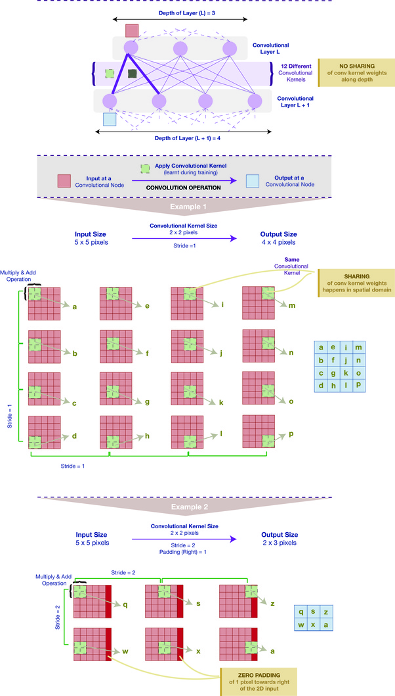
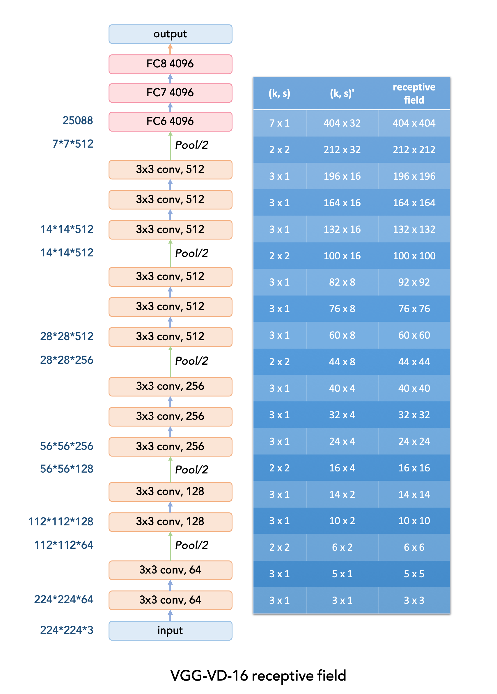
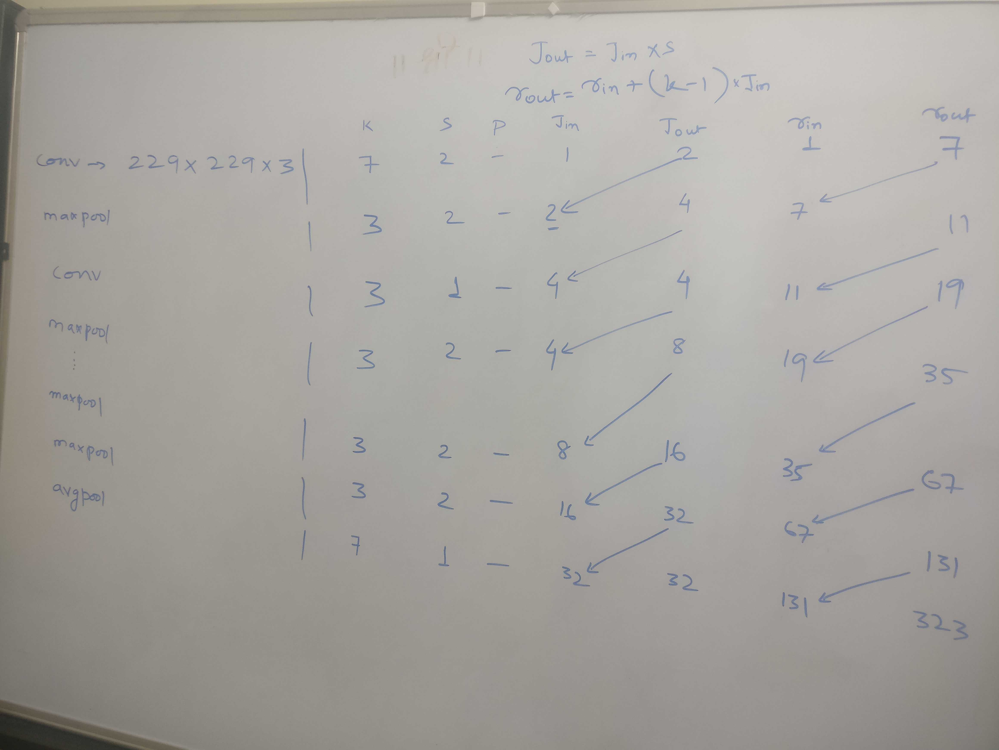

*Receptive Field Calculations*

By applying a convolution C with kernel size **k = 3x3**, padding size **p = 1x1**, stride **s = 2x2** on an input map **5x5**, we will get an output feature map **3x3**  Applying the same convolution on top of the 3x3 feature map, we will get a **2x2** feature map. The number of output features in each dimension can be calculated using the following formula

=======
**Convolutional Neural Network Equations**

The equation for computing output image size post convolution can be calculated using below formula:

Padding: How much additional information you are adding to the layer

Stride: How many pixels are you skipping while convolving.

Refer below image for better understanding:

Once we have calculated the output image size using the above formula, we need to calculate:

1. Jump: The distance between 2 adjacent features
2. Receptive field: How many pixel(image size) your current layer will see [Link](<https://www.quora.com/What-is-max-pooling-in-convolutional-neural-networks>)
3. Start: The center coordinate of the upper left feature (the first feature)

Now lets get see some examples:

1. Layer1: Number of input Feature, N(in) = 64x64m, receptive field R(in) =1, Jump J(in) = 1

2. Layer2: After 3x3 convolution with padding = 1 and stride = 2
   1. Number of output Feature, N(out) = [64 + (2*1) -3]/2 + 1 = 32
   2. Output receptive field, R(out) = 1 + (3 - 1) * 1 = 3
   3. J(out) = 1*2 = 2 

3. Layer3: Now we will perform MaxPooling and stride 2 on above layer(Example of MP on an image with stride 2)

   ****

   1. Number of output Feature, N(out) = [32 + (2*0) -2]/2 + 1 = 16
   2. Output receptive field, R(out) = 3 + (2 - 1) * 2 = 5
   3. J(out) = 2*2 = 4 

4. Layer4: After 5x5 convolution with padding = 1 and stride = 2
   1. Number of output Feature, N(out) = [16+ (2*1) - 5]/2 + 1 = 7
   2. Output receptive field, R(out) = 5 + (5 - 1) * 4 = 19 
   3. J(out) = 4*2 = 8 

Now lets take our game 1 notch up and try VGG-VD-16 receptive field

 

Formula to be used:

Layer0: Input image of size 224x224x3

1. Convolution 3x3:  
   1. Layer1: R(out) =  1 + (3-1) * 1 = 3
   2. J(out) = 1*1 = 1
2. Convolution 3x3: 
   1. Layer2: R(out) = 3 + (3-1)* 1 = 5
   2. J(out) = 1*1 = 1
3. Max Pool (2x2):
   1. Layer3: R(out) = 5 + (2-1)* 1 = 6
   2. J(out) = 1 * 2 = 2 //In Maxpool stride will be 2
4. Convolution 3x3: 
   1. Layer4: R(out) = 6 + (3-1)* (1*2) = 10
   2. J(out) = 2 * 1
5. Convolution 3x3: 
   1. Layer5: R(out) = 10 + (3-1)* (1*2) = 14
   2. J(out) = 2*1 = 2
6. Max Pool (2x2):
   1. Layer6: R(out) = 14 + (2-1)* 2 = 16
   2. J(out) = 2 * 2 = 4 //In Maxpool stride will be 2
7. Convolution 3x3: 
   1. Layer7: R(out) = 16 + (3-1)* 4 = 24
   2. J(out) = 4*1 = 4
8. Convolution 3x3: 
   1. Layer8: R(out) = 24 + (3-1)* 4 = 32
   2. J(out) = 4*1 = 4
9. Convolution 3x3: 
   1. Layer9: R(out) = 32 + (3-1)* 4 = 40
   2. J(out) = 4*1 = 4
10. Max Pool (2x2):
    1. Layer10: R(out) = 40 + (2-1)* 4 = 44
    2. J(out) = 4 * 2 = 8 //In Maxpool stride will be 2
11. Convolution 3x3: 
    1. Layer11: R(out) = 44 + (3-1)* 8 = 60
    2. J(out) = 8*1 = 8
12. Convolution 3x3: 
    1. Layer12: R(out) = 60 + (3-1)* 8 = 76
    2. J(out) = 8*1 = 8
13. Convolution 3x3: 
    1. Layer13: R(out) = 76 + (3-1)* 8 = 92
    2. J(out) = 8*1 = 8
14. Max Pool (2x2):
    1. Layer14: R(out) = 92 + (2-1)* 8 = 100
    2. J(out) = 8 * 2 = 16 //In Maxpool stride will be 2
15. Convolution 3x3: 
    1. Layer15: R(out) = 100 + (3-1)* 16 = 132
    2. J(out) = 16*1 = 16
16. Convolution 3x3: 
    1. Layer16: R(out) = 132+ (3-1)* 16 = 132 + 32 = 164
    2. J(out) = 16*1 = 16
17. Convolution 3x3: 
    1. Layer17: R(out) = 164 + (3-1)* 16 = 164 + 32 = 196
    2. J(out) = 16*1 = 16
18. Max Pool (2x2):
    1. Layer18: R(out) = 196 + (2-1)* 16 = 196 + 16 = 212
    2. J(out) = 16 * 2 = 32 //In Maxpool stride will be 2
19. FC:
    1. Layer19: R(out) = 212 + (7-1)*32  = 212 + 192 = 404

On page 6 of [Going deeper with convolutions](<https://arxiv.org/pdf/1409.4842.pdf>) whitepaper, author have mentioned that RF of the network is 224x224. So let's solve it. 

